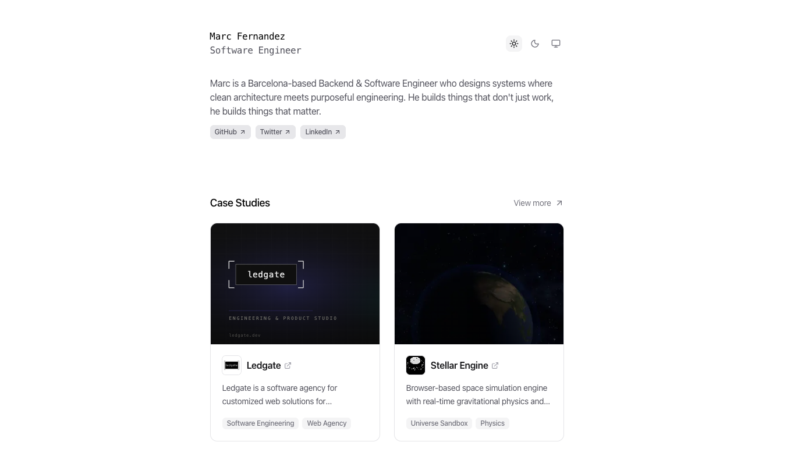

<div align="center">
  <a href="https://marcfernandez.me">
    
  </a>

  <br/>
  <br/>

  <p>
    <a href="https://marcfernandez.me" target="_blank">🌐 Live Site</a>
    &nbsp;·&nbsp;
    <a href="https://www.linkedin.com/in/marcfernandezo" target="_blank">LinkedIn</a>
    &nbsp;·&nbsp;
    <a href="https://x.com/marcfernandezo" target="_blank">X / Twitter</a>
  </p>

  <p>
    
    
  </p>
</div>

---

## About

Source code for my personal website — a space where I showcase my projects, experience, and writing.

Built with performance and clean architecture in mind.

## Getting Started

**Prerequisites:** Node.js 18+ and pnpm

```bash
# Clone the repository
git clone https://github.com/marcfernandezo/marcfernandez.me.git
cd marcfernandez.me

# Install dependencies
npm install -g pnpm   # skip if you already have pnpm
pnpm install

# Start dev server
pnpm dev
```

The site will be available at `http://localhost:3000`.

## Contributing

Contributions, bug reports, and suggestions are welcome.

1. [Fork](https://github.com/marcfernandezo/marcfernandez.me/fork) the repository
2. Create a feature branch: `git checkout -b feat/your-feature`
3. Commit your changes: `git commit -m "feat: add your feature"`
4. Push and open a Pull Request

## License

Distributed under the [Apache License 2.0](LICENSE).